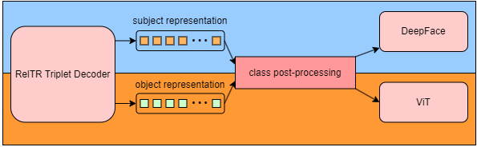
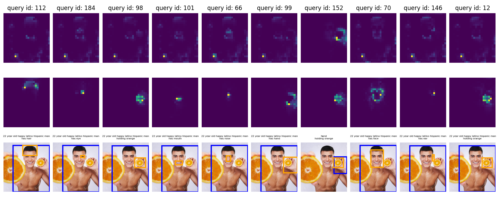
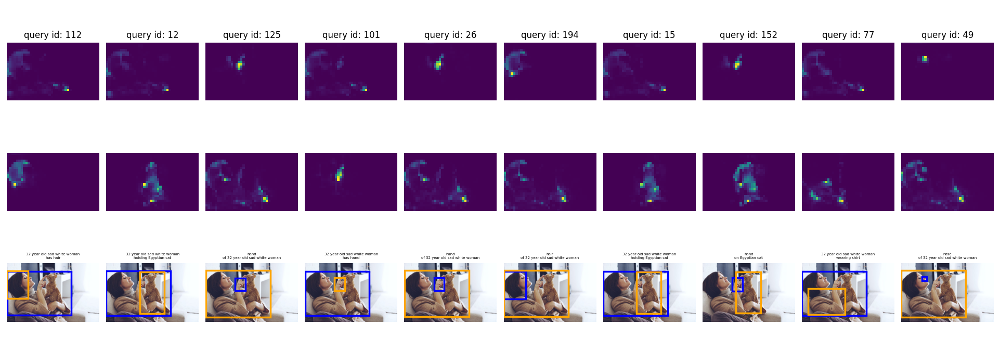

# Deeper_RelTR

Part of [LLMETA](https://github.com/orgs/sw24-11/repositories) project, we implement Relation Transformer which can classify even deeper.
LLMETA project is for metadata extraction from text (research paper), also in image too.
But, as you can see, we didn't extract any metadata like file size or things like that we normally know about.

We propose a new metadata for image as scene graph, which can use various research field.
But, our RelTR-based model can classify human emotions, age, races based on deepface and also various breeds based on ImageNet classes.
More details can be found in our brief [paper](https://github.com/KBH00/Deeper_RelTR/blob/main/demo/paper.pdf).


<p align="center">
  
</p>

<p align="center">
    Network of Deeper RelTR Model
</p>


# 1. Installation
Download **Deeper_RelTR Repo** with:
```
git clone https://github.com/KBH00/Deeper_RelTR.git
cd Deeper_RelTR
```


## For Inference
```
# create a conda environment
conda create -n drm python=3.11
conda activate drm
```
```
# install packages
# for windows
pip3 install torch torchvision torchaudio --index-url https://download.pytorch.org/whl/cu121

# for linux
pip3 install torch torchvision torchaudio
```

```
# other pakages
pip install deepface
pip install tf-keras
pip install transformers
pip install scipy
pip install matplotlib
```

## Or you can use environment.yml or requirements.txt
```
conda env create --file environment.yml
```
```
pip install -r requirements.txt
```


# 2. Usage

## Inference
a) Download [RelTR model](https://drive.google.com/file/d/1id6oD_iwiNDD6HyCn2ORgRTIKkPD3tUD/view) pretrained on the Visual Genome dataset and put it under 
```
ckpt/checkpoint0149.pth
```
b) Infer the relationships in an image with the command:
```
python img_inference.py --img_path $IMAGE_PATH --resume $MODEL_PATH 
```
We attached some images from **internet**. You can also test with your customized image.


# 3. Examples

you can see the results that can classify man to 22 year old happy latino man.
<p align="center">
  
</p>


also even in animal breeds, but sometimes the accuracy of human emotions is lower than expected.
which can turn on or off from our system.
<p align="center">
  
</p>


# 4. Table

|label|RelTR|Ours|
|------|---|---|
|Human|12|504|
|Animal|10|347|
|Others|4|18|

number of classifiable labels


|Method|R@50(V6)|R@50(V6+detailed)|
|------|---|---|
|RelTR|71.66|28.41|
|Ours|73.52|54.85|

Comparsion on V6 and detailed test set


# References
https://github.com/yrcong/RelTR

https://github.com/serengil/deepface
